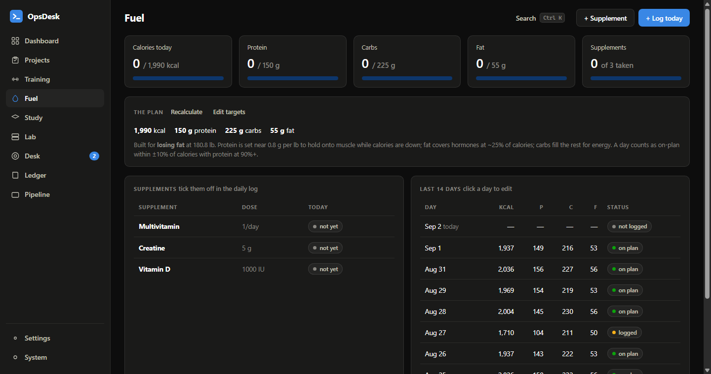

# OpsDesk

**Run your goals like an operations department — and get 1% better every day.**

Projects, training, food & supplements, study, money, job hunt, even a homelab — one local-first app with one dashboard that scores your day **automatically** from what you log. No server, no account, no build step, no telemetry.

**Live:** https://jameshunter1.github.io/opsdesk/

   


---

## The 1% engine

The dashboard is built on a simple theory: **improve 1% on the days you show up, and let it compound.**

- **Today's 1%** — each configured area contributes one point: macros in range (±10% calories, protein ≥ 90%), all supplements taken, workout done *on a planned day*, study minutes hit. Scored entirely from your logs — nothing extra to tick, so it can't nag.
- **Rest days count as kept.** Recovery is part of the plan, not a miss.
- **Consistency strip** — the last 14 days as dots; green = kept (75%+ of your points).
- **The compound curve** — every kept day multiplies you by ×1.01. Missed days don't punish you; they just don't multiply. Watching that curve bend is the whole motivation model.
- **Only what you configure counts.** No food plan? Fuel doesn't score. No routine? Training only scores when you log something. Guidance without micromanagement.

## The departments

| Module | What it does |
|---|---|
| **Projects** | Outcomes broken into steps. Every project always shows exactly one **next action** — never the whole mountain — and ticking a step lands on the dashboard. |
| **Training** | A weekly routine (Push/Pull/Legs and friends, preset or custom) that shows what today is; a real **sets × reps × weight** log; cardio sessions; body-weight check-ins with a trend line; automatic **PR table** with estimated 1RMs. |
| **Fuel** | A **calorie plan maker**: four questions (Mifflin-St Jeor + activity + goal) → daily calories, protein, carbs, fat — explained in plain words. One 20-second log a day: macros + tick off vitamins/creatine. 14-day history with tolerant "on plan" badges. |
| **Study** | A daily minutes target that feeds the score, quick session logging, curriculum modules with proof-of-work, a cert tracker, a command vault with drills — and an **interview drill** built from your own resolved tickets. |
| **Desk** | Personal tickets/to-dos with cause → fix → **lesson**; resolved lessons become a searchable knowledge base. |
| **Ledger** | Real double-entry books (or plain "I spent money" in Simple mode), trial balance, CSV export. |
| **Pipeline** | Job applications by stage with an activity log and resume-version tracking. |
| **Lab** | Homelab inventory: VM fleet, network zones, and a firewall policy matrix where every rule needs a one-sentence reason. |

Every module is **toggleable** in Settings — run only the departments you want. Press <kbd>Ctrl</kbd>+<kbd>K</kbd> anywhere to search everything and fire quick actions ("Log today's food", "Log workout", "Weigh-in"…).




## Two modes — pick your language

On first run, OpsDesk asks one question:

- **Keep it simple** — plain everyday words: *Home, Projects, Workouts, Food, Learning, To-dos, Money*. Money entry is "I spent money / I got paid / I moved money"; to-dos ask "What needs doing?".
- **The full IT department** — pro vocabulary (tickets, ledger, debits) plus the homelab module, loaded with demo data.

Same data model underneath — switching modes anytime is lossless.

## Quick start

**Easiest:** the live site — https://jameshunter1.github.io/opsdesk/ — install it from Chrome/Edge as an app (works offline).

**Local:** clone or download, double-click `index.html`. That's the install.

```
git clone https://github.com/Jameshunter1/opsdesk.git
cd opsdesk
start index.html
```

Then: make a food plan (Fuel), set a routine (Training), set a study target (Study) — the dashboard walks you through it — and start logging. **Read the [user guide](docs/guide.md)**; the [changelog](CHANGELOG.md) tracks releases.

## Your data

Everything lives in your browser's `localStorage` — nothing ever leaves your machine (the page is static files; check the network tab). **Settings → Export backup** produces one JSON file with your whole world; import restores it. Export before clearing browser data or switching machines.

## Design notes

- **Zero dependencies, zero build** — classic scripts so it runs from `file://`; the shared-namespace trade-off is documented and deliberate.
- **The score is derived, never declared.** There is no "mark day complete" button. You log real things (a workout, a meal total, minutes studied) and the day scores itself — that's what keeps it honest and un-naggy.
- **Tolerance is a feature.** ±10% calories, 90% protein, rest days kept: the system is designed so a good-enough day counts, because streaks die on perfectionism.
- **Charts follow a validated palette** (colorblind-safe in light and dark), hand-rolled SVG, no libraries.

## Project structure

```
index.html            shell + script order
manifest.webmanifest  PWA identity · sw.js — offline cache
css/app.css           design tokens (light + dark) and all components
js/store.js           state, persistence, modes/modules, the day-score engine (OD.goals)
js/seed.js            demo data (pro) + everyday starter (simple)
js/ui.js              modals, forms, badges, toasts
js/charts.js          columns, line, meter, funnel bars, day-dots
js/palette.js         Ctrl+K command palette
js/welcome.js         first-run choice
js/views/             dashboard, projects, fitness, fuel, study, desk, ledger, pipeline, lab, settings
```

## Roadmap ideas

- Macro quick-fill from your last logged day
- Per-exercise progression charts (pick a key lift, watch the line)
- Weekly review card: "your week in one paragraph"
- CSV import for the ledger

## License

MIT — see [LICENSE](LICENSE).
