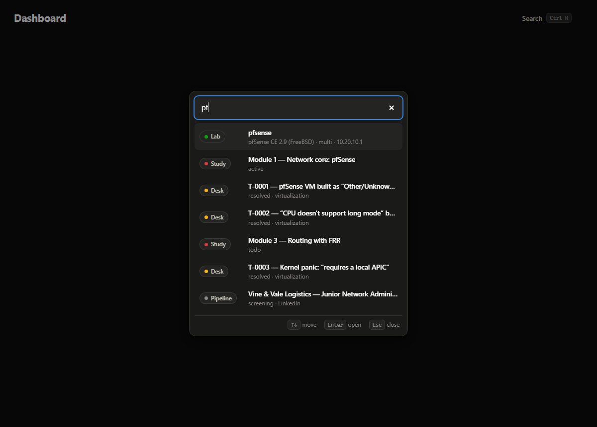

# OpsDesk

**A one-person IT department.** Homelab inventory, a personal service desk with a knowledge base, honest double-entry books, a job-application funnel, and a study tracker — one local-first app.

**Live:** https://jameshunter1.github.io/opsdesk/

   

No server. No account. No build step. No telemetry. Open `index.html` and it runs; your data never leaves your browser.


---

## Why this exists

Running a homelab, hunting for an IT job, studying for certs, and keeping your money straight are usually four scattered spreadsheets and a pile of notes. OpsDesk treats them as one operation, the way an actual IT department would:

| The department | The module | What it holds |
|---|---|---|
| Infrastructure | **Lab** | VM fleet (specs, zones, IPs, status), network zones, and a firewall policy matrix where every rule carries a one-sentence reason |
| Service desk | **Desk** | Numbered tickets (incidents *and* tasks) with symptom → root cause → fix → **lesson**; every resolved ticket with a lesson becomes a knowledge-base article |
| Finance | **Ledger** | Real double-entry bookkeeping — every transaction is a debit and a credit, the trial balance proves the books balance, and CSV export feeds Excel/Sheets |
| Business development | **Pipeline** | Job applications by stage, which resume version each one used, and a dated activity log so follow-ups never rely on memory |
| Training | **Study** | Curriculum modules with proof-of-work, a cert tracker, a command vault with a drill mode — and an **interview drill** that turns your resolved tickets into behavioural-question practice |
| Management | **Dashboard** | KPIs, six months of cash flow, the application funnel, open tickets, and a cross-module activity feed |

And one thing that ties it together: press <kbd>Ctrl</kbd>+<kbd>K</kbd> anywhere and search *everything* — a ticket number, a VM, a company, a subnet, a command — and jump straight to it.



## Quick start

**Easiest:** use the live site — https://jameshunter1.github.io/opsdesk/ — and click **Install** in Chrome/Edge if you want it as a windowed app (it works offline).

**Local:** clone (or download ZIP), then double-click `index.html`. That's the whole install.

```
git clone https://github.com/Jameshunter1/opsdesk.git
cd opsdesk
start index.html        # Windows — or just double-click it
```

First run loads **sample data** modeled on a small VirtualBox + pfSense homelab (golden images, LAN/SRV/DMZ zones, a default-deny rules matrix) so every screen means something immediately. Make it yours by editing anything, or wipe it with **Settings → Start blank**.

**Read the [user guide](docs/guide.md)** for a walkthrough of every module, and the [changelog](CHANGELOG.md) for what's new.

## Keyboard

| Key | Does |
|---|---|
| <kbd>Ctrl</kbd>+<kbd>K</kbd> or <kbd>/</kbd> | Command palette — search everything, run quick actions |
| <kbd>↑</kbd> <kbd>↓</kbd> <kbd>Enter</kbd> | Move / open inside the palette |
| <kbd>Esc</kbd> | Close any dialog |

## Your data

- Everything lives in your browser's `localStorage` under the key `opsdesk.v1`. Nothing ever leaves your machine — the page is static files, and you can verify there's no traffic in DevTools.
- **Settings → Export backup** downloads the whole workspace as one JSON file; **Import backup** restores it. Export before clearing browser data or switching computers.
- Because storage is per-browser *and* per-site, the live site and a local copy are separate workspaces — move between them with export/import.

## Design notes

- **Zero dependencies, zero build.** Plain HTML/CSS/JS with classic script files, so it runs from `file://` as happily as from a web server. The trade-off (a shared `OD` namespace instead of ES modules) is deliberate: nothing to install is the feature.
- **Double-entry, not a budget app.** A transaction moves value from a credit account to a debit account, so the books can't *not* balance — and the trial balance view shows the proof. Account types follow the accounting equation (assets, liabilities, equity, income, expenses).
- **The firewall matrix mirrors how pfSense thinks.** Rules control who may *start* a conversation (state handles replies), unset cells read as implicit default-deny, and the form refuses a rule without a one-sentence reason — design first, build second.
- **Charts follow a validated palette.** Both light and dark themes use color pairs checked for colorblind-safe separation and surface contrast; dark mode is its own tuned palette, not an auto-inversion.
- **Tickets are a habit, not a toy.** The cause/fix/lesson structure exists because the lesson is the part future-you needs — it's what turns an incident log into a knowledge base, and (via the interview drill) into interview answers.
- **Offline by service worker, local by architecture.** The PWA layer caches the app shell network-first; the data never needed the network at all.

## Project structure

```
index.html            shell: sidebar, topbar, script order
manifest.webmanifest  PWA identity (name, icons, colors)
sw.js                 service worker — network-first cache for offline
css/app.css           design tokens (light + dark) and all components
js/store.js           state, persistence, export/import, shared queries
js/seed.js            the demo homelab
js/ui.js              escaping, badges, toasts, modals, generic form builder
js/charts.js          SVG column chart, funnel bars, progress meter
js/palette.js         Ctrl+K command palette
js/views/*.js         one file per module (dashboard, lab, desk, ledger, pipeline, study, settings)
js/app.js             hash router, theme, boot, SW registration
docs/                 user guide + screenshots
```

## Contributing

Issues and PRs are welcome — this is a small, dependency-free codebase that's easy to read top to bottom. If you're adding a feature, keep the rules: no dependencies, no build step, every dynamic value escaped, and both themes checked.

## Roadmap ideas

- Ping/uptime notes per VM and a packet-capture log in the Lab
- Budget targets per expense account with variance on the dashboard
- Printable one-page "lab résumé" — zones, fleet, and rules as a PDF-ready sheet
- Optional CSV import for the ledger

## License

MIT — see [LICENSE](LICENSE).
