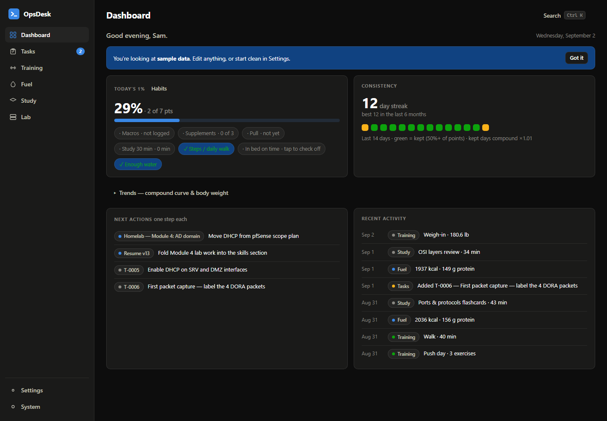
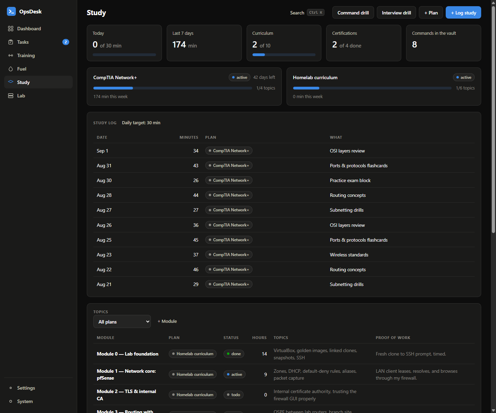
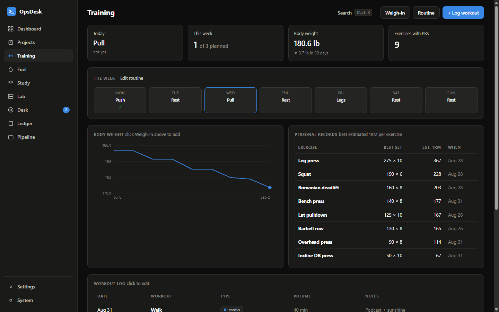

# OpsDesk

**Run your goals like an operations department — and get 1% better every day.**

Tasks & projects, training, food & supplements, study plans, even a homelab — one local-first app with one calm dashboard that scores your day **automatically** from what you log. No server, no account, no build step, no telemetry.

**Live:** https://jameshunter1.github.io/opsdesk/

   



---

## The 1% engine

The dashboard is built on a simple theory: **improve 1% on the days you show up, and let it compound.**

- **Today's 1% — graded, not pass/fail.** Each configured area scores 0–1: macros by how close you landed to target (goal-aware — cutting tolerates under-eating, bulking tolerates over), supplements by the fraction taken, training by showing up on planned days, study by minutes vs. target **with a bonus for overshooting** (up to 1.25). Near the target earns near-full credit; drifting off fades smoothly instead of snapping to zero.
- **Habits — the part you check off yourself.** Daily habits (steps, bedtime, water — your list) are one point each, tap-to-toggle right on the dashboard, and count in the score like everything else.
- **Rest days count as kept.** Recovery is part of the plan, not a miss.
- **Your green bar, your call** — a day is "kept" at 50% (*showing up*), 75% (*solid*), or 100% (*all or nothing*), set in Settings. Kept days extend the streak.
- **The compound curve is graded too** — a kept day multiplies you by 1% × its score: ×1.010 for a perfect day, up to ×1.0125 with overshoot, a little even for a bare showed-up day. Missed days don't punish you; they just don't multiply.
- **Only what you configure counts.** No food plan? Fuel doesn't score. No routine? Training only scores when you log something. Guidance without micromanagement.

## The departments — five tabs, on purpose

| Module | What it does |
|---|---|
| **Tasks** | One answer to "what should I do next?": projects (multi-step outcomes, each showing exactly one highlighted **next action**) plus loose to-dos with cause → fix → **lesson** — and everything you've solved lives in a searchable **Solved & saved** tab. |
| **Training** | A weekly routine (Push/Pull/Legs and friends, preset or custom) that shows what today is; a real **sets × reps × weight** log; cardio sessions; body-weight check-ins with a trend line; automatic **PR table** with estimated 1RMs. |
| **Fuel** | A **calorie plan maker**: four questions (Mifflin-St Jeor + activity + goal) → daily calories, protein, carbs, fat — explained in plain words. One 20-second log a day: macros + tick off vitamins/creatine. 14-day history with graded "on plan" badges. |
| **Study** | **Multiple plans at once** — Network+, CCNA, anything — each with its own topics, progress bar, weekly minutes, and exam countdown. A daily minutes target feeds the day score; sessions log against a plan; drills (including the **interview drill** built from your own solved problems) keep it sticky. |
| **Lab** | Homelab inventory: VM fleet, network zones, and a firewall policy matrix where every rule needs a one-sentence reason. |

Every module is **toggleable** in Settings — run only the departments you want. Press <kbd>Ctrl</kbd>+<kbd>K</kbd> anywhere to search everything and fire quick actions ("Log today's food", "Log workout", "Weigh-in"…).

> v3 removed the Ledger (money) and Pipeline (job hunt) modules to keep the app focused. Workspaces that had entries keep them tucked in an invisible archive inside their backup file.




## Two modes — pick your language

On first run, OpsDesk asks one question:

- **Keep it simple** — plain everyday words: *Home, Tasks, Workouts, Food, Learning*; to-dos ask "What needs doing?".
- **The full setup** — ops vocabulary (tickets, modules) plus the homelab tab, loaded with demo data.

Same data model underneath — switching modes anytime is lossless.

## Quick start

**Easiest:** the live site — https://jameshunter1.github.io/opsdesk/ — install it from Chrome/Edge as an app (works offline).

**Local:** clone or download, double-click `index.html`. That's the install.

```
git clone https://github.com/Jameshunter1/opsdesk.git
cd opsdesk
start index.html
```

Then: make a food plan (Fuel), set a routine (Training), set a study target (Study) — the dashboard walks you through it — and start logging. **Read the [user guide](docs/guide.md)**; the [changelog](CHANGELOG.md) tracks releases.

## Your data

Everything lives in your browser's `localStorage` — by default nothing ever leaves your machine (the page is static files; check the network tab). **Settings → Export backup** produces one JSON file with your whole world; import restores it.

**Want it on every device? Run your own backend.** [`server/server.js`](server/README.md) is a complete self-hosted sync server — one file, plain Node, SQLite via the built-in driver, zero npm installs: `node server.js` and it's up. Create an account in **Settings → Account & sync** and your workspace follows you to any device you sign in on, with honest conflict prompts when two devices diverge. Local-first stays true — instant saves, full offline — and no third party ever holds your data.

## Design notes

- **Zero dependencies, zero build** — classic scripts so it runs from `file://`; the shared-namespace trade-off is documented and deliberate.
- **The score is mostly derived, never nagged.** You log real things (a workout, a meal total, minutes studied) and the day scores itself; the only manual part is habits you chose yourself, and they're one tap.
- **Tolerance is a feature.** Goal-aware calorie bands, graded partial credit, rest days kept: a good-enough day counts, because streaks die on perfectionism.
- **Less surface on purpose.** v3 deleted two whole modules and folded two more together — a tracker you'll actually open beats a dashboard that tracks everything.
- **Charts follow a validated palette** (colorblind-safe in light and dark), hand-rolled SVG, no libraries.

## Project structure

```
index.html            shell + script order
manifest.webmanifest  PWA identity · sw.js — offline cache
css/app.css           design tokens (light + dark) and all components
js/store.js           state, persistence, migrations, the day-score engine (OD.goals)
js/seed.js            demo data (pro) + everyday starter (simple)
js/ui.js              modals, forms, badges, toasts
js/charts.js          columns, line, meter, bars, day-dots
js/palette.js         Ctrl+K command palette
js/welcome.js         first-run choice
js/views/             dashboard, tasks, fitness, fuel, study, lab, settings
```

## Roadmap ideas

- Macro quick-fill from your last logged day
- Per-exercise progression charts (pick a key lift, watch the line)
- Weekly review card: "your week in one paragraph"

## License

MIT — see [LICENSE](LICENSE).
