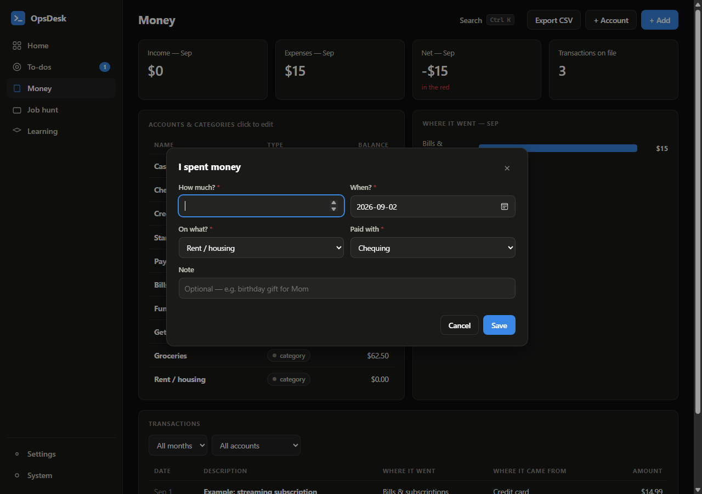

# OpsDesk user guide

OpsDesk is a **local-first** app: everything you enter lives in your browser, on your machine. This guide walks through every module, the keyboard shortcuts, and how to keep your data safe.

- [Two modes: Simple and Pro](#two-modes-simple-and-pro)
- [Getting around](#getting-around)
- [The 1% dashboard](#the-1-dashboard)
- [Projects](#projects)
- [Training](#training)
- [Fuel](#fuel)
- [Lab](#lab)
- [Desk](#desk)
- [Ledger](#ledger)
- [Pipeline](#pipeline)
- [Study](#study)
- [Your data: backups, moving machines](#your-data)
- [Install it like an app](#install-it-like-an-app)
- [FAQ](#faq)

---

## Two modes: Simple and Pro

On first run, OpsDesk asks what it should be for you:

- **Simple** — plain everyday language. The sidebar reads *Home, To-dos, Money, Job hunt, Learning*. Money is recorded as **"I spent money," "I got paid,"** or **"I moved money"** — how much, on what, paid with, done. To-dos ask "What needs doing?" instead of showing ticket jargon, and the homelab module doesn't appear at all. You start with everyday accounts (Chequing, Credit card, Groceries…) and three worked examples you can delete.
- **Pro** — the full IT-department experience: tickets with root causes, a double-entry ledger with a trial balance, the homelab tracker with its firewall matrix, and command drills. Starts loaded with a demo homelab to explore.

**It's the same data underneath.** A simple-mode purchase is stored as a correct double-entry transaction, so nothing is lost switching between modes — change anytime in **Settings → Experience**, where you can also turn individual modules on or off (want Money and To-dos but no Job hunt? Untick it).

## Getting around

The sidebar is the map — in Pro mode **Dashboard → Lab → Desk → Ledger → Pipeline → Study**, in Simple mode **Home → To-dos → Money → Job hunt → Learning** — with Settings and the theme toggle at the bottom. The theme cycles System → Light → Dark. Modules you've turned off in Settings simply don't appear.

**The fastest way to anything is the command palette.** Press <kbd>Ctrl</kbd>+<kbd>K</kbd> (or <kbd>/</kbd>) and type. It searches every module at once — VM names, ticket text, KB lessons, transaction descriptions, companies, study topics, commands — and <kbd>Enter</kbd> jumps straight to the record. It also carries quick actions: type "new" to see *New ticket*, *New transaction*, *New VM*, *New application*, *New module*, and *Export backup*.

| Key | Does |
|---|---|
| <kbd>Ctrl</kbd>+<kbd>K</kbd> or <kbd>/</kbd> | Open the command palette |
| <kbd>↑</kbd> <kbd>↓</kbd> then <kbd>Enter</kbd> | Move and open in the palette |
| <kbd>Esc</kbd> | Close any dialog |

Everywhere in the app, **clicking a table row opens that record** for viewing or editing, and the buttons in the top-right corner create new records for the current module.

## The 1% dashboard

The home screen runs on one idea: **get 1% better on the days you show up, and let it compound.**

**How a day is scored — graded, mostly automatic:**

| Component | Counts when… | Score (0–1 each) |
|---|---|---|
| Macros | you've made a food plan | Average of a calorie score and a protein score. Calories get full credit inside a goal-aware band (cutting tolerates under-eating to −20%, bulking tolerates over to +20%, ±10% otherwise) and fade toward 0 the further outside it you land. Protein is logged ÷ (90% of target), capped at 1 — extra protein is fine, not extra credit. |
| Supplements | your list isn't empty | The fraction you ticked — 2 of 3 taken scores 0.67, not zero. |
| Training | you've set a weekly routine | Planned day: 1 if a workout is logged. **Rest day: 1 automatically** — recovery is part of the plan. |
| Study | you've set a daily minutes target | Minutes ÷ target — and overshooting pays a **bonus up to 1.25** (45 min against a 30-min target scores 1.25). |
| **Habits** | your habit list isn't empty | **1 point each, checked off by hand** — the chips on the dashboard are tap-to-toggle. Manage the list via the *Habits* button (keep it short enough to be honest about). |

Numbers above and below target both matter: being close earns most of the point, blowing past a more-is-better target earns extra, and drifting far off fades smoothly instead of flipping to zero. Areas you haven't configured don't count, so nothing drags the score down while you're setting up.

- **Green day** = your chosen share of the points — the **green bar** in Settings: *Showing up* (50%), *Solid* (75%), or *All or nothing* (100%). Green days extend your **streak**.
- **The compound curve is graded too:** a kept day multiplies you by **1% × its score** — a perfect day is ×1.010, an overshoot day up to ×1.0125, a bare showed-up day still grows you a little. Days under the bar don't punish you; they just don't multiply.
- **Next actions** shows one step per active project plus your top open to-dos — never the whole mountain.
- Everything you log anywhere lands in the **activity feed**.

## Projects

A project is any outcome with more than one step: pass a cert, redo a resume, clear the garage. Give it a name, a one-line *why* (it shows up when motivation doesn't), and steps. OpsDesk always highlights the **next** unfinished step — on the project card and on the dashboard. Ticking a step logs the date and feeds the activity feed. Status: active / paused / done.

## Training

- **Routine** — name each weekday (blank = rest) or tap a preset: Push/Pull/Legs, Upper/Lower ×4, Full body ×3. The week strip shows every day, today highlighted, checkmarks where you trained.
- **Workouts** — *+ Log workout*: date, label (pre-filled with today's planned session), lifting or cardio. Lifting takes any number of exercise rows (name, sets, reps, weight); cardio takes minutes.
- **PRs** — computed automatically: your best set per exercise with an estimated 1RM (Epley), sorted strongest first. Watch these climb — that's the clearest 1% there is.
- **Weigh-ins** — quick entries in lb or kg (same scale, same time of day; the trend matters, single days don't). The trend line lives here and on the dashboard.

## Fuel

- **The plan maker** asks four things — body, age, height/weight, activity, goal — and computes daily calories (Mifflin-St Jeor × activity, then −20% to cut / +10% to build), protein (~0.8 g/lb), fat (25% of calories), carbs (the rest). Every number comes with a plain-words reason, and *Recalculate* is right there when your weight changes. Know your targets already? *Edit targets* sets them directly.
- **The daily log** is one 20-second entry: protein, carbs, fat (calories compute themselves) plus a tick for each supplement on your list — creatine, vitamins, whatever you add. One log per day; click any day in the 14-day history to fix it.
- **"On plan" is tolerant by design**: ±10% on calories and 90% on protein counts. Perfection kills streaks; good-enough compounds.

## Dashboard (the ops cards)

Below the 1% engine, the operational cards stay: six months of income vs. expenses, the job funnel, open tickets, and the merged activity feed. Modules you've turned off simply don't appear.

On first run the app offers **sample data** so every screen demonstrates itself. Dismiss the banner and edit anything — or wipe it in **Settings**.

## Lab

Three registers that mirror how a segmented lab is actually designed:

- **Network zones** — name, interface, subnet, gateway, DHCP range. WAN is treated as where the internet comes from, not a place rules originate.
- **VM fleet** — OS, zone, IP, RAM/vCPU/disk, role, and a status: `running`, `stopped`, `planned`, or `template` (golden images that never join the lab network). The *RAM committed* tile totals what's running versus what the whole fleet would need — useful when the host has 16 GB and you run only what the current module needs.
- **Firewall policy matrix** — the design-first heart of the Lab. Rows are source zones, columns are destinations plus Internet. Click a cell to set **allow / limited / block**; *limited* takes a port list (e.g. `80, 443, 53`). Every rule requires a **one-sentence reason**, shown on hover — if you can't explain a rule in one sentence, it isn't designed yet. Cells you haven't designed read `unset`, which means implicit default-deny.

The matrix mirrors how pfSense evaluates traffic: rules decide who may *start* a conversation; the stateful firewall lets replies come back on their own.

## Desk

A personal service desk with two ticket types:

- **Incidents** — something broke. Record the *symptom* (what it looked like), the *root cause* (the actual reason, not the first scary error line), the *fix*, and the **lesson** — the one-liner future-you needs.
- **Tasks** — planned work, tracked with the same numbering.

Tickets get sequential numbers (`T-0001`, …) and move **open → in-progress → resolved** (quick buttons in the ticket detail). 

**The knowledge base builds itself:** every resolved ticket that has a lesson appears in the *Knowledge base* tab as an article — cause, fix, lesson — full-text searchable. This is the habit that turns troubleshooting into experience you can point at.

## Ledger

Real double-entry bookkeeping, not a budget toy:

- **Accounts** have one of five types — *asset, liability, equity, income, expense* — following the accounting equation. Assets and expenses grow with debits; the other three grow with credits.
- **Every transaction is one debit and one credit** of the same amount. Spending on the lab? Debit *Lab & hardware*, credit *Chequing* (or *Visa*). Payday? Debit *Chequing*, credit *Pay*. The form's hints say exactly this, and it refuses a transaction whose debit and credit are the same account.
- **The trial balance proves it.** Total debits always equal total credits — the *balanced* badge is computed, not decorative.
- **Export CSV** (top-right) writes every transaction to a file that opens cleanly in Excel, Google Sheets, or real accounting software.

Balances are shown from each account's natural perspective, so a liability with money owing reads as a positive "you owe this," and a negative number always means something worth investigating.

## Pipeline

The job hunt as a funnel: **saved → applied → screening → interview → offer**, closing out as *accepted* or *rejected*.

Each application records the company, role, source, posting URL, salary, and — the part that pays off later — **which resume version you used** and a **dated activity log**. Open an application and use *Log it* to note every call, email, and follow-up; use *Move to* to change stage (which also logs itself). The table sorts by last touch, so the application going stale is always visible.

## Study

Deliberate learning, four tools:

- **Daily target + log** — set a minutes-per-day target you can hit on a *bad* day (20–30 min compounds), then *+ Log study* records sessions. Hitting the target earns the study point in your day score; the tiles show today and the last 7 days.
- **Curriculum** — modules with a status, hours logged, topics, and a **proof of work**: the demonstrable thing that says it's done ("fresh clone to SSH prompt, timed"). Progress feeds the dashboard meter.
- **Certifications** — planned / studying / scheduled / passed, with target dates.
- **Command vault** — the "commands I know cold" list. **Command drill** shuffles the vault and quizzes you description-first. **Interview drill** goes one better: it deals your *resolved tickets* as behavioural-interview practice — say your answer out loud (situation, diagnosis, what you did, takeaway), then check it against your own write-up. Your homelab war stories become interview answers.

## Your data

- Everything is stored in the browser's `localStorage` under the key `opsdesk.v1`. Nothing is sent anywhere, ever.
- **Settings → Export backup** downloads the entire workspace as one JSON file. **Import backup** restores it (replacing what's there). Export before clearing browser data, switching browsers, or moving machines.
- Storage is per-browser *and* per-site: the live site and a local copy are separate workspaces. Move between them with export/import.
- **Reset to sample data** restores the demo homelab; **Start blank** gives an empty workspace. Both warn first.

## Install it like an app

From the live site, Chrome and Edge offer **Install** (the icon in the address bar, or menu → *Apps → Install OpsDesk*). You get a windowed app with its own icon, and a service worker keeps it working **offline** — fitting, since your data never needed the network in the first place.

## FAQ

**Is my financial/job data visible to anyone?**
No. There's no server and no telemetry — the page is static files. Data stays in your browser. (Verify it yourself: DevTools → Network.)

**I cleared my browser data and lost everything.**
That's the one way to lose it — localStorage went with the cache. Restore from your exported JSON. If you don't have one: Settings → Export backup takes five seconds; make it a habit after big entries.

**Can two devices share one workspace?**
Not live — by design there's no sync server. Export on one, import on the other.

**The ticket numbers skip after I delete tickets.**
Intentional: numbers are never reused, like a real ticketing system.

**Why classic `<script>` tags instead of ES modules?**
So the app runs from `file://` with a double-click, no server needed. Zero install is the feature; the shared `OD` namespace is the price, paid once.
